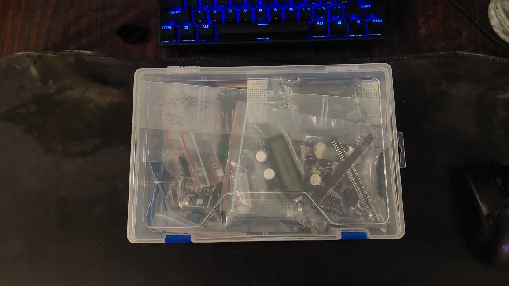
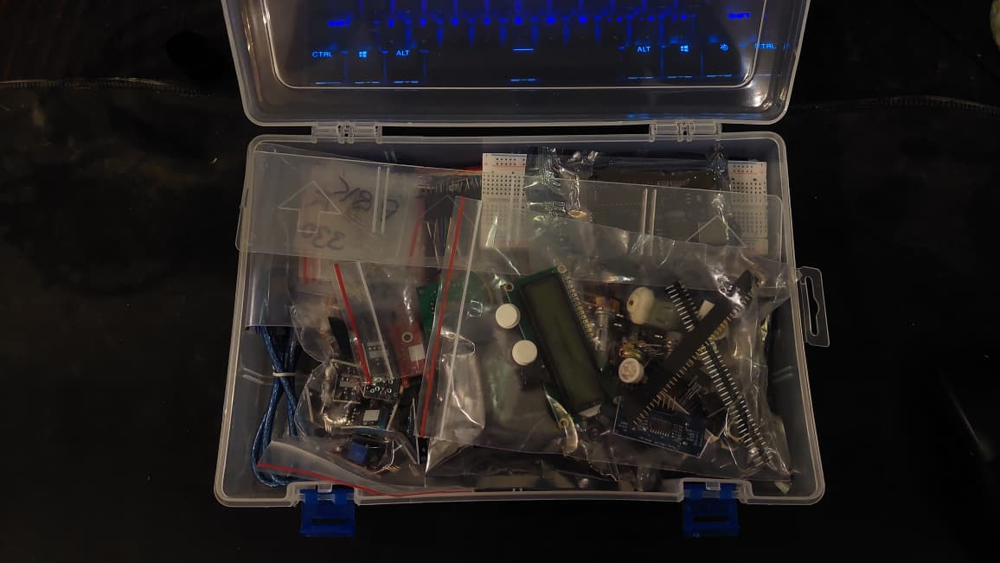
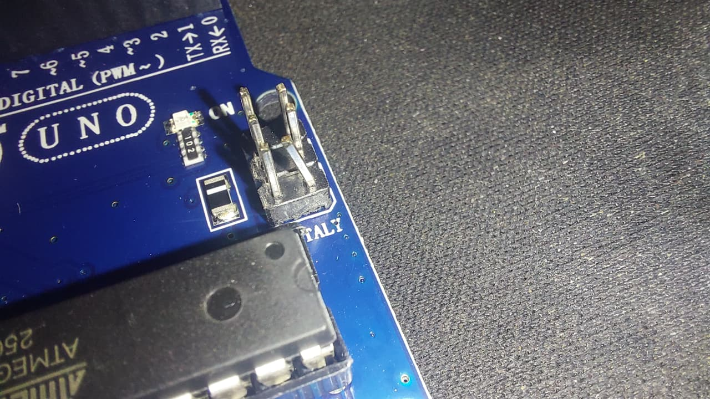
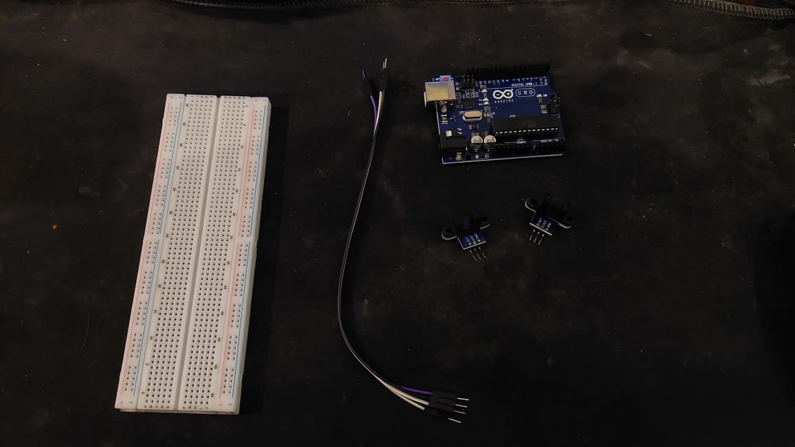

# free-fall-photogate-timer
Arduino-based dual photogate system for experimental measurement of gravitational acceleration

## Project Overview
- **Microcontroller:** Arduino Uno R3
- **Sensors:** 2x Slotted Optical IR Photogate Modules
- **Methodology:** Non-blocking hardware interrupts (`attachInterrupt`) capturing `micros()` timestamps on Pins 2 and 3.

## Circuit Mapping
- **Gate 1 (Top):** Signal -> Digital Pin 2
- **Gate 2 (Bottom):** Signal -> Digital Pin 3
- **Power:** 5V and GND shared on breadboard rail

---

## Engineering & Development Log

### Entry 1: Initial Setup & Unboxing
- **Date:** Today
- **Status:** In Progress
- **What was easy:** Setting up the repository structure on GitHub.
- **Problems / Doubts:** Figuring out how to connect the optical sensors to the breadboard and identifying whether the pins output HIGH or LOW when blocked.
- **Next Steps:** Wire Gate 1 to the Arduino and run a single-sensor diagnostic test.

 
 

-----

### Entry 2: Component Inspection & Hardware Identification
- **Status:** Unpacked primary components from briefcase.
- **Hardware Inspected:** Arduino Uno R3, MB102 breadboard, male-to-male jumpers, 10cm male-to-female ribbon, 2x optical photogates.
- **Defect Noted & Resolved:**
  - *Slightly Bent ICSP Pin:* Observed a bent pin on the 2x3 ICSP header out of the box. Manually re-aligned it. Non-critical as signal lines route to digital I/O pins 2 & 3.
- **Wiring Setup:** Selected long M-M jumpers for breadboard power distribution (5V/GND rails).
- **Next Step:** Connect power rails to Gate 1 and run `sensor_test.ino`.

