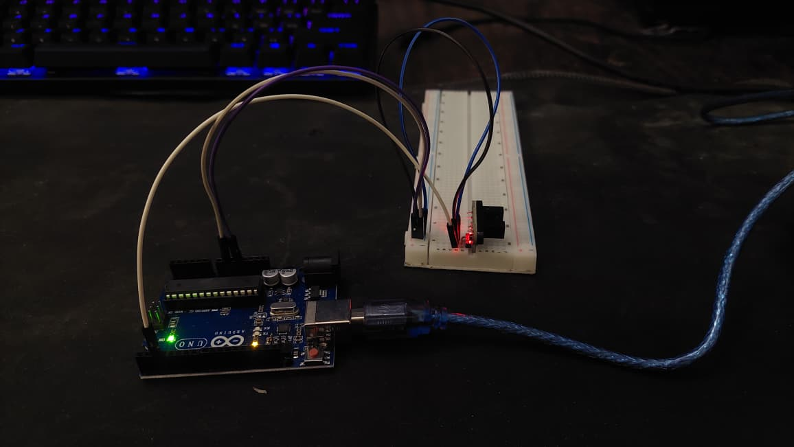
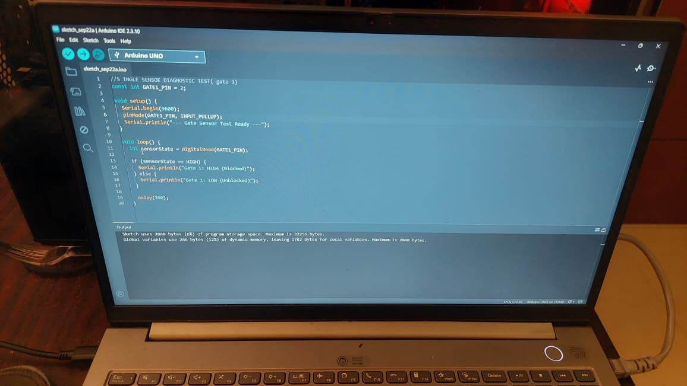

# free-fall-photogate-timer
Arduino-based dual photogate system for experimental measurement of gravitational acceleration

## Project Overview
- **Microcontroller:** Arduino Uno R3
- **Sensors:** 2x Slotted Optical IR Photogate Modules
- **Methodology:** Non-blocking hardware interrupts (`attachInterrupt`) capturing `micros()` timestamps on Pins 2 and 3.

## Circuit Mapping
- **Gate 1 (Top):** Signal -> Digital Pin 2
- **Gate 2 (Bottom):** Signal -> Digital Pin 3
- **Power:** 5V and GND shared on breadboard rail

---

## Engineering & Development Log

### Entry 1: Initial Setup & Unboxing
- **Date:** Today
- **Status:** In Progress
- **What was easy:** Setting up the repository structure on GitHub.
- **Problems / Doubts:** Figuring out how to connect the optical sensors to the breadboard and identifying whether the pins output HIGH or LOW when blocked.
- **Next Steps:** Wire Gate 1 to the Arduino and run a single-sensor diagnostic test.

 
 

-----

### Entry 2: Component Inspection & Hardware Identification
- **Status:** Unpacked primary components from briefcase.
- **Hardware Inspected:** Arduino Uno R3, MB102 breadboard, male-to-male jumpers, 10cm male-to-female ribbon, 2x optical photogates.
- **Defect Noted & Resolved:**
  - *Slightly Bent ICSP Pin:* Observed a bent pin on the 2x3 ICSP header out of the box. Manually re-aligned it. Non-critical as signal lines route to digital I/O pins 2 & 3.
- **Wiring Setup:** Selected long M-M jumpers for breadboard power distribution (5V/GND rails).
- **Next Step:** Connect power rails to Gate 1 and run `sensor_test.ino`.

---

### Entry 3: Gate 1 Wiring & Sensor Orientation
- **Status:** Complete & Powered
- **Hardware Setup:** Connected Gate 1 to breadboard power rails (5V/GND) and routed signal line to Digital Pin 2 on the Arduino Uno.
- **Circuit Adjustments & Physical Constraints:**
  - *Sensor Orientation:* Oriented the photogate facing outward to ensure breadboard columns remain accessible for jumper connections behind the header.
  - *Jumper Allocation:* Required 1 additional 20cm M-M jumper wire for rail distribution beyond the initial count.
- **Power Verification:** Verified onboard status LED on photogate module illuminates upon USB power connection.

- **Next Step:** Upload single-sensor test script and verify interrupt/signal state in Serial Monitor.

### Entry 4: Diagnostic Code Upload, IDE Setup & Sensor Verification
- **Status:** Verified & Complete
- **Software Setup:** Created and compiled `sensor_test.ino` targeting the Arduino Uno board (Digital Pin 2).
- **Environment & Troubleshooting Hurdles:**
  - *Board / FQBN Selection:* Fixed initial compilation failure by explicitly selecting the `Arduino Uno` target board and matching COM port in Arduino IDE 2.x.
  - *Keyboard Layout Discrepancies:* Encountered keymapping mismatches while typing out the script manually on a physical UK QWERTY keyboard operating under a US software keymap (causing symbol misalignments like quotes and semicolons).
  - *Syntax Debugging:* Diagnosed and resolved a missing semicolon line error (`expected ';' before...`) directly inside the IDE compiler output before finalizing the sketch.
- **Signal Logic Verification:**
  - **Unblocked State:** `LOW` ($0$) — Infrared beam hits the photo-transistor uninterrupted.
  - **Blocked State:** `HIGH` ($1$) — Object interrupts the beam path.

- **Next Step:** Assemble Gate 2 hardware module on the breadboard and write the two-gate interrupt timing code.
